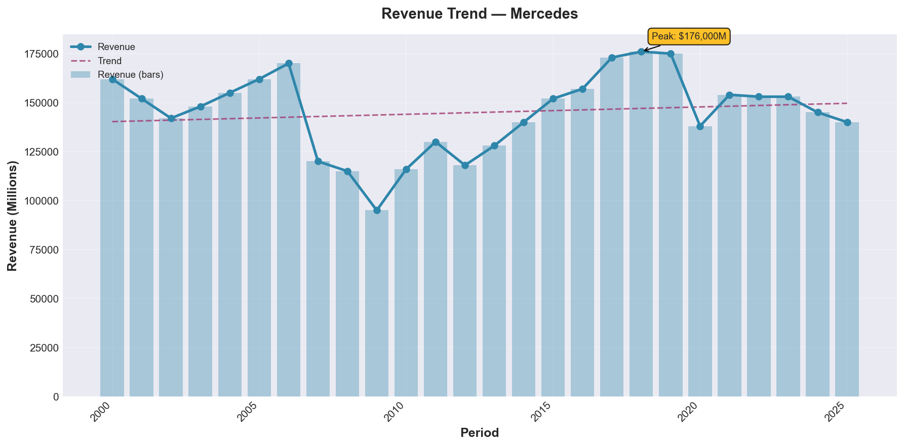
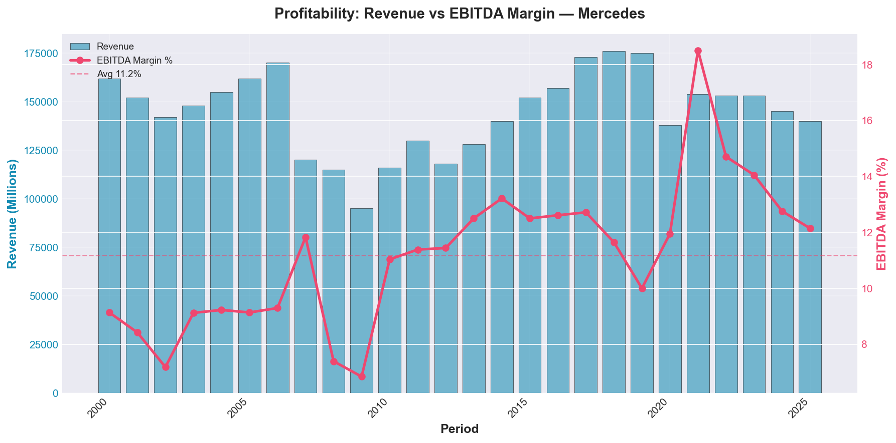
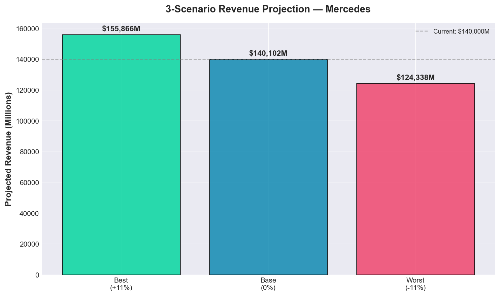
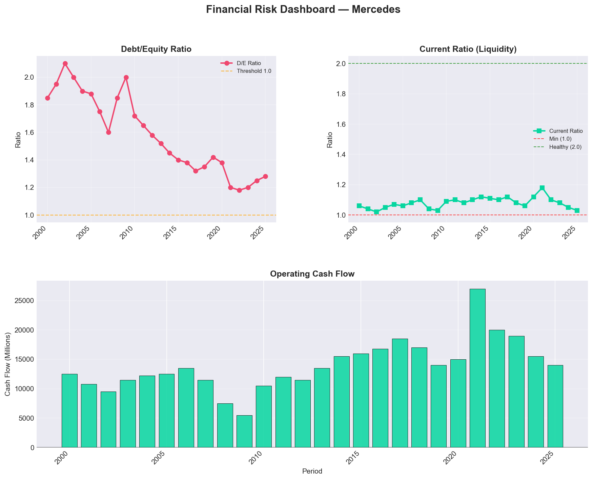
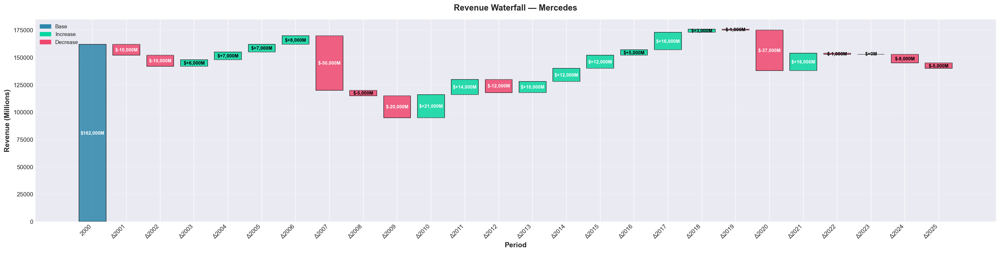
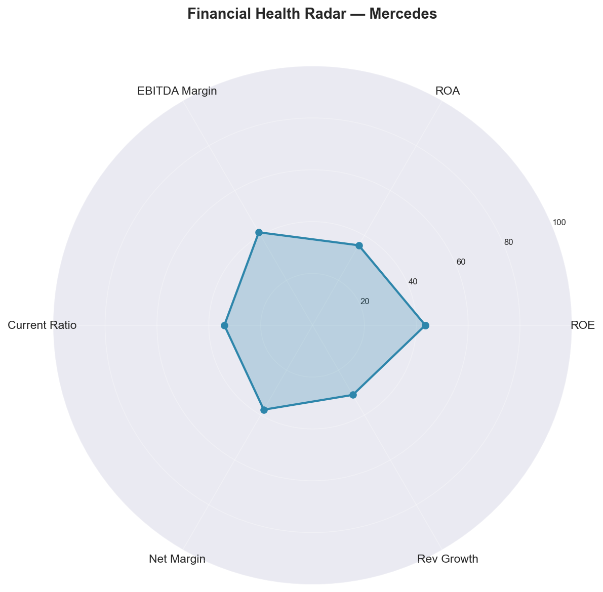

<div align="center">

# 📊 Financial FP&A Intelligence

### Enterprise-Grade AI Financial Analysis · Powered by CrewAI & Groq

[](https://streamlit.io/)
[](https://python.org)
[](https://crewai.com)
[](https://groq.com)
[](LICENSE)

**A robust 2-stage AI pipeline that transforms raw financial CSV data into executive-grade PDF reports and rich visualizations — without hitting API rate limits.**

[🚀 Quick Start](#-installation) · [📸 Demo](#-live-demo--sample-output) · [📖 How It Works](#%EF%B8%8F-how-it-works) · [📋 Usage](#-usage)

</div>

---

## 🌟 Overview

**Financial FP&A Intelligence** is an AI-driven financial planning & analysis application built on a battle-tested **2-Stage Pipeline Architecture**. It transitions away from fragile multi-agent ReAct loops toward a stable, deterministic approach — ensuring your analysis always completes, even under strict API rate limits (Groq TPM / Gemini free-tier).

Upload any company's historical financial CSV → get back a complete **6-chart visual suite** + a synthesized **executive PDF report** in seconds.

---

## 📸 Live Demo & Sample Output

> The following outputs were generated by analyzing **Mercedes-Benz Group AG** financial data (2000–2025).

### 📄 Full PDF Report
> 📥 **[Download Mercedes\_analysis.pdf](reports/Mercedes_analysis.pdf)** — Complete executive-level FP&A report with scenario analysis, risk assessment, and CFO memo.

---

### 📈 Revenue Trend Analysis


---

### 💹 Profitability Analysis


---

### 🔮 Scenario Comparison (Best / Base / Worst)


---

### ⚠️ Risk Dashboard


---

### 🌊 Revenue Waterfall


---

### 🕸️ Financial Radar Metrics


---

## ✨ Key Features

| Feature | Description |
| :--- | :--- |
| 🖥️ **Streamlit Web Dashboard** | Interactive UI with file upload, company selector, live progress, and tabbed results viewer |
| ⚡ **2-Stage Pipeline** | Stage 1: pure-Python computation + chart generation. Stage 2: single LLM call for narrative synthesis |
| 🛡️ **Deterministic Fallbacks** | Structured report generated automatically if LLM API is unavailable |
| 💾 **Intelligent Caching** | Disk-backed `FPAAnalysisCache` skips redundant processing on re-runs |
| 📈 **6 Auto-Generated Charts** | Revenue Trend, Profitability, Scenario Comparison, Risk Dashboard, Revenue Waterfall, Financial Radar |
| 📄 **Multi-Format Export** | Download as PDF report, individual PNG charts, or raw JSON data |

---

## 🏗️ How It Works

```
📂 Upload CSV
      │
      ▼
┌─────────────────────────────────────┐
│  STAGE 1 — Pure Python (No LLM)     │
│  ✔ Data validation & FP&A metrics   │
│  ✔ Scenario modelling (B/B/W)       │
│  ✔ Risk scoring & benchmarking      │
│  ✔ Generate 6 PNG charts            │
└──────────────────┬──────────────────┘
                   │
                   ▼
┌─────────────────────────────────────┐
│  STAGE 2 — Single LLM Call (Groq)   │
│  ✔ Narrative synthesis              │
│  ✔ Executive CFO memo               │
│  ✔ Structured PDF generation        │
└──────────────────┬──────────────────┘
                   │
                   ▼
          📑 Final PDF Report
```

---

## 🤖 AI Agent Roles

The analysis models the expertise of five specialized financial roles:

| Agent | Role |
| :--- | :--- |
| 📊 **FP&A Analyst** | Evaluates historical performance, CAGR, and profitability trends |
| 🔮 **Scenario Planning Analyst** | Builds probability-weighted best / base / worst-case projections |
| ⚠️ **Financial Risk Analyst** | Assesses liquidity, leverage, and flags critical risk indicators |
| 🌐 **Market Researcher** | Benchmarks metrics against sector-specific industry standards |
| 👔 **CFO Advisor** | Synthesizes all findings into a board-ready executive memo |

---

## 🛠️ Tech Stack

| Component | Technology |
| :--- | :--- |
| **Web Framework** | [Streamlit](https://streamlit.io/) |
| **AI Orchestration** | [CrewAI](https://crewai.com) (Flows, Knowledge Sources) |
| **LLM Provider** | Groq / Google Gemini APIs |
| **Data Processing** | Pandas, NumPy |
| **Visualizations** | Matplotlib, Seaborn |
| **Reporting** | ReportLab (PDF generation) |

---

## 💡 Recommended LLM Configuration

> **🔥 MAXIMIZE PERFORMANCE WITH GROQ**
>
> We strongly recommend using the **Groq API** with the `meta-llama/llama-4-scout-17b-16e-instruct` model. This model offers the best reasoning quality **and** the highest tokens-per-minute (TPM) limit on Groq's free tier — ensuring your multi-stage pipeline completes without hitting rate limit bottlenecks.

---

## 📦 Installation

Ensure you have **Python >=3.10 <=3.13** installed.

**1. Clone the repository:**
```bash
git clone <your-repository-url>
cd financial_fpa
```

**2. Install dependencies:**
```bash
pip install -r requirements.txt
```
*(Alternatively: `crewai install` to lock and install via `uv`.)*

**3. Configure environment variables:**

Create a `.env` file in the root directory:
```env
GROQ_API_KEY=your_groq_api_key
# or
OPENAI_API_KEY=your_openai_api_key
```

---

## 💻 Usage

Launch the interactive dashboard from the project root:

```bash
streamlit run streamlit_app.py
```

### 📋 Step-by-Step

1. Go to the **Upload & Configure** tab.
2. **Upload your financial CSV** — must match the schema below.
3. Select the **Company** from the dropdown (auto-detects sector).
4. Click **▶ Run Analysis**.
5. Review charts and narrative in the **Results & Charts** / **Detailed Analysis** tabs.
6. Download the PDF, PNG charts, or JSON from the **Download Report** tab.

### 📐 CSV Schema Requirements

> ⚠️ **Your CSV must strictly follow the structure of `src/data/modified_financial_data.csv`.**

**Required columns (exact names):**

| Column | Column | Column |
| :--- | :--- | :--- |
| `Period` | `Company` | `Category` |
| `Market_Cap` | `Revenue` | `Gross Profit` |
| `Net Income` | `Earning Per Share` | `EBITDA` |
| `Share Holder Equity` | `Operating_Cash_Flow` | `Investing_Cash_Flow` |
| `Financing_Cash_Flow` | `Current Ratio` | `Debt/Equity Ratio` |
| `ROE` | `ROA` | `ROI` |
| `Net Profit Margin` | `Free Cash Flow per Share` | `Return on Tangible Equity` |
| `Employees` | `Inflation` | `Revenue_Growth` |
| `Net_Income_Growth` | `EBITDA_Margin` | `Net_Cash_Flow` |
| `Revenue_per_Employee` | `High_Leverage_Risk` | `Liquidity_Risk` |

> 💡 Sample demo datasets are included in `src/data/` — use `modified_financial_data.csv`, `anthropic_financial_data.csv`, or `mercedes_financial_data.csv` to test immediately.

---

## 📁 Output Artifacts

| Directory | Contents |
| :--- | :--- |
| `charts/` | 6 PNG financial visualizations per analysis run |
| `reports/` | Synthesized executive PDF reports |
| `cache/` | Analysis hashes for fast re-runs |
| `logs/` | Execution and pipeline tracking logs |

---

## 🤝 Contributing & Support

- Open an **Issue** to report bugs or request features.
- Submit a **Pull Request** to contribute improvements.
- Built with ❤️ using [CrewAI](https://crewai.com).

---

<div align="center">

*If you find this project useful, please give it a ⭐ on GitHub — it helps a lot!*

</div>
